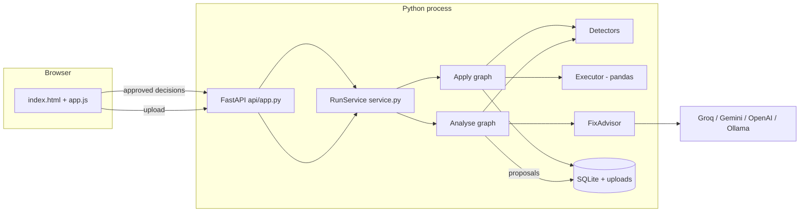

# Architecture

How the pieces fit together, and why they were built this way. The README covers using the app; this covers how it works.

## The one-paragraph version

A FastAPI backend serves a static HTML frontend and a JSON API. An uploaded file is stored byte-for-byte and read as text. A **LangGraph** analyse phase profiles it, runs nine deterministic detectors, scores the result, and asks an LLM to recommend one fix per issue from a fixed menu. The workflow then **stops** and hands the proposals to the browser. When the user approves a set of decisions, a second LangGraph phase applies only those, using hand-written pandas functions, re-runs every detector on the result and scores it again. Everything is written to SQLite, including an audit trail.

## System overview

One Python process, no queue, no worker service, no external database. `dq-agent serve` is the whole deployment.

## Trust boundaries

Every piece of information carries a trust level, and each level has exactly one way to advance:

| Stage | What it is | Produced by | Can an LLM touch it? |
|---|---|---|---|
| **Data** | The uploaded file, byte for byte | The user | No |
| **Facts** | Profiles and detector findings | Pure functions of (data, settings) | No |
| **Advice** | A recommended strategy plus reasoning | LLM, constrained to a per-issue menu | Yes, this is its only job |
| **Decision** | What will actually be applied | The human, in the browser | No |
| **Change** | The modified DataFrame | Hand-written pandas functions | No |
| **Verdict** | The score after | The same detectors, re-run | No |

No stage is skipped. The executor re-derives the allowed strategies from the issue rather than trusting what arrived with the request, so a decision forged against the API cannot apply an illegal fix.

This is why the app can offer AI-assisted cleaning without "an LLM runs code against your data" being the real behaviour.

## The two graphs

`pipeline/graph.py` compiles two `StateGraph`s over one `DQState`.

**Analyse** (`profile → detect → score_before → advise`):

| Node | Brief bullet | What it does | LLM? |
|---|---|---|---|
| `profile` | Profiler | Row and column counts, dtype, null counts, sample values, how numeric and date-like each column looks | No |
| `detect` | Detector Agent | Nine checks, sorted worst-first | No |
| `score_before` | Validator, first pass | The 0-100 score and its four dimensions | No |
| `advise` | Fixer Agent | One allowed strategy plus reasoning per issue | Yes |

**Apply** (`apply_fixes → revalidate`):

| Node | Brief bullet | What it does | LLM? |
|---|---|---|---|
| `apply_fixes` | Executor | Runs approved decisions in a safe order, records what changed | No |
| `revalidate` | Validator, second pass | Runs all nine detectors again and re-scores | No |

**Why split at the approval point?** The brief calls for human-in-the-loop. A person may take an hour to answer, or never come back, so holding a graph run open is the wrong shape. The analyse phase ends by producing proposals; the apply phase starts from the decisions. Both share node functions and state type, so a session reads as one workflow in two acts in LangSmith.

**Why re-run the detectors instead of subtracting what was fixed?** Because a fix that did not work must be visible. Re-running is the only honest way to say the score improved. It is also how the app reports issues that a fix created: coercing a column to numbers turns unconvertible values into blanks, and the second pass reports those as a new missing-value issue rather than hiding them.

## Detectors

`detectors/rules.py`. Each is `(DataFrame, Settings) -> list[Issue]`, pure, and sorted into the final list worst-first by severity then by share of rows affected.

An `Issue` carries what was found, how bad it is, how many rows, up to five real examples, the strategies that are legal for it, a conservative default, and machine-readable `metrics` the executor later needs (an outlier's computed bounds, whether the column is numeric).

Two design points worth stating:

- **Severity is a label, not a number.** `low`/`medium`/`high`/`critical` map to weights only inside the scorer. A detector never invents a precision it does not have.
- **A detector that cannot be sure declines.** Outliers need at least 20 values and a non-zero inter-quartile range. The invalid-format check only runs on columns whose *name* says what they should hold, so the rule can be stated plainly rather than guessed.

### Reading a file literally

`sources.load_dataframe` reads everything as text with `keep_default_na=False`. Both matter:

- Letting pandas infer types would repair a mixed-type column on read, so the detector would never see the evidence.
- Letting pandas apply its default `na_values` would turn `N/A`, `null`, `-` and a dozen other spellings into `NaN` on the way in, hiding that the column uses placeholder text at all.

`detectors/profile.py` then decides what counts as blank, in one place, with a documented `PLACEHOLDER_TOKENS` set. Placeholders count as missing *and* are reported separately ("3 of them are written out as text such as 'N/A'"), so the user learns something pandas would have silently swallowed.

The delimiter is chosen by counting known separators in the header rather than using `sep=None`. pandas' own sniffer splits a single-column file headed `total` on the letter `t`.

### The score

`detectors/scoring.py`. Each issue costs `severity_weight × f(share of rows affected)`, and the total is subtracted from 100. Each issue type maps to one of four dimensions, so the breakdown says *which kind* of problem is dragging the number down.

It is deliberately simple and fully explainable. A score nobody can explain is a score nobody trusts, and the number's job here is to be comparable between the two passes, not to be an absolute measure of dataset health.

## The executor

`fixes/executor.py` is the only module that modifies data. One small function per strategy, each returning a **new** DataFrame plus an `AppliedFix` record of exactly what changed.

**Ordering matters and is not left to the caller.** `apply_all` sorts approved decisions: tidy values first (trim, case, types, dates), then fill blanks, then remove rows, then remove columns. Deduplicating before trimming would miss rows differing only by a trailing space.

**Widening rather than failing.** pandas 3 refuses to write a float into a `str` column. `_fill_masked` retries on an object column instead of letting the fix die. Filling with an average goes further and converts the column to numbers, because leaving `"10.0"` as text would look filled while still being unusable in a sum.

**Ambiguous dates are resolved from evidence.** `looks_day_first` scans the column: if any value has a first component above 12, the column must be day-first, and `06/01/2026` means 6 January. With no such value the column is genuinely ambiguous and the month-first reading is used, which is what pandas assumes. The applied-fix detail says which reading was used, so a wrong guess is visible rather than silent.

## The advisor boundary

`llm/base.py` defines `FixAdvisor.advise(issues, context) -> AdviceResult`. Two implementations:

- `RuleFixAdvisor` (`llm/rules.py`): the conservative textbook choice per issue type, with a written reason. It is Demo mode, the test-suite's advisor, and the fallback.
- `LangChainFixAdvisor`: any LangChain chat model. Each issue is sent with its own `allowed` list, each entry carrying the plain-language description of what that fix does, so the model chooses between described options rather than guessing at names.

`parse_advice` validates against each issue's own allowed list and rejects anything outside it, feeding the specific error back for one repair attempt. Two illegal answers raise `ProviderError`.

**Two error classes, treated differently.** `ProviderError` (rate limit, network, unusable output) is recoverable: the advise node falls back to the rule advisor for every issue and records a visible warning. `ProviderAuthError` (401/403, or a 404 model-not-found) is not: it is re-raised and the run fails, because a rejected key fails every issue identically and quietly substituting rule-based advice would hide a one-click configuration problem while implying an AI had reviewed the data.

**A bounded ask.** `MAX_ISSUES_ADVISED` caps how many issues go to the model in one run. The rest get rule-based advice and a warning saying so, which bounds cost and latency without leaving any issue unadvised.

## Data model

SQLite at `data/dq.sqlite3`, plus `data/uploads/<run id>/` holding the original file and the cleaned copy.

| Table | One row per | Notes |
|---|---|---|
| `runs` | uploaded dataset | Status, row and column counts before and after, both scores and their full breakdowns, the profile, token usage, warnings |
| `issues` | detected issue | Keyed by `(run, issue id, phase)` so the before and after sets both persist |
| `advice` | recommendation | The strategy, the reasoning text, confidence, and whether it came from the LLM or the rules |
| `decisions` | human decision | What was approved, with what strategy, and when |
| `applied_fixes` | attempted fix | Whether it applied, what changed, or why it was skipped |
| `audit` | event | Timestamp, actor (`human`/`detector`/`ai`/`system`), event, detail |

The audit table is what makes the Markdown report possible months later without re-running anything. `actor` is the column that matters for governance: it distinguishes what a person decided from what the AI suggested from what the code did.

The status field is the state machine: `queued → analyzing → awaiting_approval → applying → completed`, or `failed`. `awaiting_approval` is a real resting state, not a transient one.

## Why no vector store

The brief suggests ChromaDB holding "DQ policies and fix strategies", retrieved per issue. This project does not use one, deliberately.

The corpus would be eighteen fixed strategies whose descriptions are a hundred words in total. All eighteen fit in every prompt with room to spare, and the relevant subset for an issue is already known exactly from `ALLOWED_STRATEGIES`. Embedding them and retrieving the top-k would add a dependency, a service and a failure mode while replacing an exact lookup with an approximate one.

Retrieval earns its place when the corpus is large, open-ended and changing. Here it is small, closed and versioned with the code. Saying so is more useful than importing Chroma to tick a box.

## Configuration

`config.load_settings()` layers defaults, then environment / `.env` (upper-cased field names), then `data/settings.json` written by the Settings page. `save_settings` treats an empty secret as "keep the existing value", so the UI never has to hold a key. `Settings.public_view()` replaces every secret with `<name>_set: true/false`.

`resolved_model()` returns the mock model name whenever the provider is `mock`, so Demo mode never displays a real model name beside rule-based output.

## Frontend

Plain HTML, CSS and JavaScript in `web/`, served by FastAPI. No framework, no build step. Four numbered tabs following the user's journey. The review screen is the centre: one card per issue carrying the evidence, the recommendation, a strategy dropdown with live help text, and an approve tick, with bulk controls and a sticky apply bar that counts the selection and warns about destructive fixes.

The frontend holds a `selection` map from issue id to `{approved, strategy, fill_value}` and sends the whole map on apply. The backend validates every entry against the stored issues, so the browser is never trusted.

## What is deliberately not here

- **No CrewAI.** There is one LLM task, performed once per run. Role-playing agents debating would add latency and no accuracy.
- **No generated code.** No `eval`, no `exec`, no dynamic import, anywhere.
- **No automatic application.** There is no setting that applies fixes without a human, and adding one would defeat the design.
- **No authentication.** The server binds to localhost. Put it behind a proxy with auth before exposing it.
