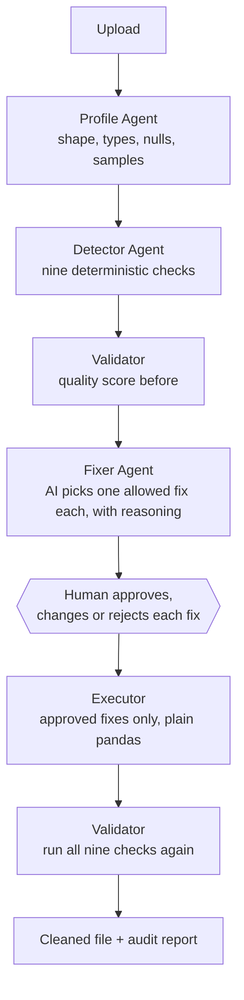

# Data Quality Guardian

**Upload a messy spreadsheet. See exactly what is wrong with it, read the AI's suggested fix and its reasoning for each problem, approve the ones you want, and download the cleaned file with a full audit trail.**

Capstone project **#14 — Data Quality Guardian** (Data Engineering, level: Advanced) from the GenAI / Agentic AI capstone programme. Built with Python, LangGraph, pandas and FastAPI, with a plain HTML frontend that needs no build step.

<p align="left">
  
  
  
  
  
  
  
  
  
</p>

---

## Table of contents

- [What it does](#what-it-does)
- [Why](#why)
- [The governing idea](#the-governing-idea)
- [The nine checks](#the-nine-checks)
- [The fixes it can apply](#the-fixes-it-can-apply)
- [How it works (the agent workflow)](#how-it-works-the-agent-workflow)
- [Quick start](#quick-start)
- [Getting your API key](#getting-your-api-key)
- [Using the app](#using-the-app)
- [Command line](#command-line)
- [Configuration reference](#configuration-reference)
- [The JSON API](#the-json-api)
- [Project structure](#project-structure)
- [How it maps to the capstone brief](#how-it-maps-to-the-capstone-brief)
- [Testing and what was verified](#testing-and-what-was-verified)
- [Troubleshooting](#troubleshooting)
- [Security notes](#security-notes)
- [Design decisions](#design-decisions)
- [Roadmap](#roadmap)
- [Contributing](#contributing)
- [License](#license)
- [Acknowledgments](#acknowledgments)

---

## Why

A duplicated row inflates every total downstream. A column of numbers stored as
text cannot be summed at all. The same city written three different ways splits
one group into three in every report. These defects are tedious to find,
worse to fix by hand, and fixing them with a script nobody reviewed is how
organisations quietly lose data — a subtly wrong transformation does not raise
an error, it just produces a plausible wrong answer that may go unnoticed for
months. This agent finds the defects deterministically, has a model recommend
one repair for each with its reasoning written out, and then requires a human
to approve every change before anything is written.

## What it does

Bad data quietly breaks everything downstream. A duplicated row inflates every total, a column of numbers stored as text cannot be summed, and the same city written three ways splits one group into three. Finding those problems is tedious, fixing them by hand is worse, and doing it with a script nobody reviewed is how you lose data.

This app does all three, with you in the loop for the part that matters:

1. **Upload a CSV or Excel file.** Every value is read as text, so nothing is silently repaired before it is inspected.
2. **Nine deterministic checks run over it.** Same file, same findings, every time. No AI involved in this step at all.
3. **It scores the dataset** from 0 to 100 across four dimensions: completeness, uniqueness, validity and consistency.
4. **An AI recommends one fix per problem** and explains its reasoning in plain language, choosing only from a fixed menu of allowed fixes.
5. **You approve, change or reject each one.** Nothing is modified until you press Apply.
6. **The approved fixes are applied with plain pandas,** and then every check is run **again** on the result, so the new score is measured rather than assumed.
7. **You download the cleaned file and a full audit report** listing every issue, every recommendation with its reasoning, every decision you made and every change that happened.

Real output from the bundled 249-row sample:

> **11 issues found. Quality score 71.0/100 (Fair).**
> After approving the AI's recommendations: **98.3/100 (Excellent)**, 9 duplicate rows removed, 96 dates normalised, 71 city names case-corrected, 12 non-numeric values blanked, 1 empty column dropped.

## The governing idea

**The AI never writes code that touches your data.**

It is given each problem plus the exact list of fixes that are legal for that problem, and it picks one and explains why. Every transformation is a small, tested pandas function that was written by hand. Nothing is ever generated, evaluated or executed from model output.

That choice is enforced three times over:

1. The prompt only ever offers the strategies allowed for that issue type.
2. The parser rejects any answer naming a strategy outside that list, and gives the model one chance to correct itself.
3. The executor re-derives the allowed list from the issue itself and refuses anything else, so even a decision arriving straight from the API cannot slip an illegal fix through.

On top of that, a human approves every change. The workflow deliberately stops and waits.

## The nine checks

| Check | What it finds | Why it matters |
|---|---|---|
| **Missing values** | Blank cells, including placeholder text such as `N/A`, `null` and `-` | Blanks break averages and joins; placeholders hide as real values |
| **Duplicate rows** | Rows that are exact copies of an earlier row | Every count and total is inflated |
| **Mixed types** | A column that is mostly numbers with a few text stragglers | The whole column stays text and cannot be summed |
| **Inconsistent dates** | One column using several date layouts | Mixed formats sort wrongly and break date filters |
| **Outliers** | Values far outside the normal range, by inter-quartile range | Often a typo such as an extra zero, sometimes genuine |
| **Whitespace** | Leading or trailing spaces | `"Delhi "` and `"Delhi"` silently become two groups |
| **Inconsistent casing** | The same value written `Mumbai`, `MUMBAI`, `mumbai` | One category counted as three |
| **Invalid format** | Values failing the rule implied by the column name (email, phone) | They fail validation in whatever system you send them to |
| **Constant columns** | A column with the same value in every row | Carries no information, only noise and file size |

All nine are pure functions of (data, settings). No LLM, no network, no randomness.

## The fixes it can apply

Eighteen named transformations, each a tested pandas function. Which are offered depends on the issue:

| Fix | What it does |
|---|---|
| `none` | Leave it alone and record the decision |
| `drop_rows` | Delete the affected rows |
| `fill_mean` / `fill_median` | Fill blanks with the average or middle value, converting the column to numbers |
| `fill_mode` | Fill blanks with the most common value |
| `fill_constant` | Fill blanks with a value you type |
| `forward_fill` | Carry the previous row's value down |
| `drop_duplicates` | Keep the first copy of each duplicated row |
| `coerce_numeric` | Convert to numbers; unconvertible values become blank |
| `normalize_dates` | Rewrite every date as `YYYY-MM-DD` |
| `trim_whitespace` | Remove leading and trailing spaces |
| `standardize_case_title` / `_upper` / `_lower` | Rewrite text in a consistent case |
| `clip_outliers` | Pull extremes back to the normal range |
| `remove_outlier_rows` | Delete rows containing extremes |
| `blank_invalid` | Blank only the failing values, keeping the rest of the row |
| `drop_column` | Remove the whole column |

Four of these remove rows or columns. The UI marks them, counts them, and asks you to confirm before applying any of them.

## How it works (the agent workflow)

Two LangGraph state machines with a human between them:



**Why two graphs rather than one?** The brief calls for a human-in-the-loop step, and a person cannot be expected to answer inside a single blocking run: they may take an hour, or never come back. So the analyse phase ends by handing over a list of proposals, and the apply phase starts from what was actually approved. Both phases share the same node functions and state type, so a full session reads as one workflow in two acts in LangSmith.

**Why re-run the checks afterwards?** Because a fix that did not help must show up. The "after" score comes from running all nine detectors again on the cleaned data, not from subtracting what was attempted.

**Failure handling:**

| What went wrong | What happens |
|---|---|
| Temporary provider problem (rate limit, network, unusable answer twice) | Falls back to the built-in expert rules for every recommendation, marks them as rule-based, and records a visible warning |
| API key rejected, or model unavailable on your plan | The run fails immediately with a message pointing at the Settings page, rather than pretending an AI advised you |
| A fix cannot legally apply | It is skipped with an explanation in the audit trail, and the rest still run |

## Quick start

You need **Python 3.10 or newer**, or Docker. An API key is optional: the app ships with a **Demo mode** whose built-in expert rules recommend a fix for every issue with no key and no network.

**Windows** (PowerShell):

```powershell
cd Data-Quality-Guardian
.\start.ps1
```

**macOS / Linux**:

```bash
cd Data-Quality-Guardian
chmod +x start.sh && ./start.sh
```

**Docker**:

```bash
docker compose up --build
```

The launcher creates a virtual environment, installs the app, starts the server and opens it in your browser at `http://127.0.0.1:8401`. If that port is busy it moves to the next free one and prints the address.

> If PowerShell refuses to run the script, run this once: `Set-ExecutionPolicy -Scope CurrentUser RemoteSigned`

## Getting your API key

| Service | Needed for | Where | Format |
|---|---|---|---|
| **Groq** | AI-recommended fixes with reasoning | [console.groq.com/keys](https://console.groq.com/keys), free tier | `gsk_...` |
| Google Gemini | Alternative provider | [aistudio.google.com/app/apikey](https://aistudio.google.com/app/apikey), free tier | `AIza...` |
| OpenAI | Alternative provider | [platform.openai.com](https://platform.openai.com/api-keys), paid | `sk-...` |
| Ollama | Fully local and private | Install [ollama.com](https://ollama.com), then `ollama pull llama3.1` | no key |
| LangSmith | Tracing the workflow | [smith.langchain.com](https://smith.langchain.com), free tier | `lsv2_...` |

Enter them on the **Setup** tab with a Test button beside each, or put them in a `.env` file (copy `.env.example`).

## Using the app

### 1 · Setup

Pick the provider and paste its key, then **Save** and **Test connection**. The Groq default is `openai/gpt-oss-120b`.

> **Note on Groq models.** Groq rotates which models its free tier serves, and `llama-3.3-70b-versatile` has been retired. If you see "does not offer the model", check [console.groq.com/docs/models](https://console.groq.com/docs/models) and paste a current model name into the Model box.

You can also tune how strict the checks are: at what share of blanks a column is reported, at what share it becomes critical, and how sensitive outlier detection should be.

### 2 · Upload data

Drop in a CSV, TSV or Excel file up to 25 MB and 200,000 rows, or try one of the two bundled samples. The messy one has eleven planted problems; the clean one should come back with nothing wrong.

### 3 · Review & fix

This is the heart of the app. For every problem you see:

- **What is wrong**, with a severity badge, how many rows are affected and what share of the file that is.
- **Why it matters**, in one plain sentence.
- **Real examples** from your own data.
- **The AI's recommendation** with its reasoning and confidence, or a built-in rule's recommendation if no AI is configured.
- **A dropdown** to choose a different fix, with a plain-language explanation of what each one does.
- **An Approve tick** you control.

Bulk controls let you approve all, approve none, or approve only the non-destructive fixes. The bar at the bottom counts what is selected and warns when any of them remove rows or columns. Applying asks for confirmation if so.

Afterwards you see what changed, what is still outstanding, a before-and-after preview of your data, and the full audit trail. Download the cleaned CSV and the audit report as Markdown.

### 4 · History

Every dataset you have checked, with its score before and after, and how much quality improved on average.

## Command line

```bash
dq-agent serve                              # start the web app
dq-agent serve --open --port 8200           # open a browser, use a specific port
dq-agent scan data.csv                      # detect and report, no AI, no changes
dq-agent clean data.csv -o cleaned.csv      # detect, apply the recommended fixes, save
dq-agent clean data.csv --provider mock     # same using the built-in rules only
```

`scan` never modifies anything and never calls an AI, which makes it safe to run against anything.

## Configuration reference

Every setting can be set on the Setup page **or** in `.env`. The Setup page wins.

| Setting | Default | Meaning |
|---|---|---|
| `LLM_PROVIDER` | `groq` | `mock`, `groq`, `gemini`, `openai` or `ollama` |
| `LLM_MODEL` | provider default | Groq `openai/gpt-oss-120b`, Gemini `gemini-2.5-flash`, OpenAI `gpt-4o-mini`, Ollama `llama3.1` |
| `GROQ_API_KEY` / `GOOGLE_API_KEY` / `OPENAI_API_KEY` | | Only the one matching the provider |
| `OLLAMA_BASE_URL` | `http://localhost:11434` | Where Ollama listens |
| `MISSING_WARN_PCT` | `5` | Report a column as incomplete above this share of blanks |
| `MISSING_CRITICAL_PCT` | `40` | Above this, mark it critical |
| `OUTLIER_IQR_MULTIPLIER` | `3` | Outlier sensitivity. 1.5 is aggressive, 3 conservative |
| `OUTLIER_MIN_ROWS` | `20` | Below this many values, outliers are not reported |
| `MIXED_TYPE_TOLERANCE_PCT` | `2` | How many stragglers make a column mixed-type |
| `HIGH_CARDINALITY_RATIO` | `0.5` | Above this uniqueness, casing checks are skipped (identifiers, not categories) |
| `AUTO_APPROVE_SAFE_FIXES` | `false` | Reserved: pre-tick non-destructive fixes on the review screen |
| `MAX_ISSUES_ADVISED` | `40` | How many issues go to the AI per run; the rest get rule-based advice |
| `LANGCHAIN_TRACING_V2`, `LANGCHAIN_API_KEY`, `LANGCHAIN_PROJECT` | off | LangSmith tracing |
| `APP_HOST`, `APP_PORT`, `DATA_DIR` | `127.0.0.1`, `8100`, `./data` | Server binding and where data lives |

## The JSON API

Documented interactively at `/api/docs`.

| Method and path | Purpose |
|---|---|
| `GET /api/health` | Status, provider, model, tracing |
| `GET` / `PUT /api/settings` | Read and update settings. Secrets are write-only |
| `POST /api/settings/test/llm` | Test the provider with a real call |
| `GET /api/strategies` | What every fix does, in plain language |
| `POST /api/analyze` | Upload a file. Returns a `run_id`. **Never modifies anything** |
| `GET /api/runs/{id}` | Issues, recommendations, decisions, applied fixes and audit trail |
| `POST /api/runs/{id}/apply` | Apply approved decisions. The only endpoint that changes data |
| `GET /api/runs/{id}/preview?which=original\|cleaned` | A slice of the data before or after |
| `GET /api/runs/{id}/download` | The cleaned CSV |
| `GET /api/runs/{id}/audit.md` | The audit report as Markdown |
| `GET /api/runs`, `DELETE /api/runs/{id}`, `GET /api/overview` | History |
| `GET /api/samples`, `POST /api/samples/{name}/analyze` | The bundled demo datasets |

## Project structure

```text
Data-Quality-Guardian/
├── README.md, ARCHITECTURE.md, EVALUATION.md, LICENSE
├── start.ps1 / start.sh            # one-command launchers
├── Dockerfile, docker-compose.yml  # container deployment
├── pyproject.toml                  # dependencies + the `dq-agent` command
├── .env.example                    # every setting, documented
├── .github/workflows/ci.yml        # lint, tests, detector regression, Docker smoke test
├── data/                           # created at runtime, gitignored
│   ├── dq.sqlite3                  # runs, issues, advice, decisions, audit
│   └── uploads/<run id>/           # your original file and the cleaned copy
├── scripts/make_samples.py         # regenerates the demo datasets
├── src/dq_agent/
│   ├── domain.py                   # models, the fix menu, what each fix means
│   ├── config.py                   # settings: defaults < .env < data/settings.json
│   ├── detectors/
│   │   ├── profile.py              # column profiling, what counts as blank
│   │   ├── rules.py                # the nine checks
│   │   └── scoring.py              # the 0-100 score and its four dimensions
│   ├── fixes/executor.py           # the only code that modifies data
│   ├── llm/
│   │   ├── base.py                 # advisor interface, error types
│   │   ├── rules.py                # built-in expert rules: Demo mode + fallback
│   │   ├── langchain_provider.py   # Groq / Gemini / OpenAI / Ollama
│   │   └── registry.py             # picks an advisor by name
│   ├── pipeline/graph.py           # the two LangGraph phases
│   ├── sources.py                  # loading a file literally
│   ├── storage/db.py               # SQLite + the audit trail
│   ├── service.py                  # ties the phases to the API
│   ├── api/app.py                  # FastAPI routes + serves the frontend
│   ├── web/                        # index.html, styles.css, app.js (no build step)
│   ├── resources/samples/          # two demo datasets
│   └── cli.py                      # serve / scan / clean
└── tests/                          # 92 pytest tests, all offline
```

## How it maps to the capstone brief

| The brief says | This project does | Why |
|---|---|---|
| Input: CSV/Parquet/DB table + schema YAML + DQ rules | CSV, TSV and Excel upload; rules are settings with sensible defaults | A beginner should not have to write a schema file to get a first answer. Thresholds are adjustable in the UI |
| Detector Agent (LangGraph): scan, identify all issues | Nine deterministic detectors as a LangGraph node | Determinism is what makes the before/after score meaningful |
| RAG: ChromaDB for DQ policies and fix strategies | A fixed, documented fix menu with plain-language explanations | The "corpus" here is eighteen known strategies. A vector store over eighteen fixed items adds a dependency and no accuracy. See ARCHITECTURE.md |
| Fixer Agent: LLM picks the best fix, generates a code patch | LLM picks from the allowed menu and explains; deterministic pandas applies it | An LLM generating code that runs against your data is the risk this design exists to remove |
| Executor: pandas applies fixes | Exactly that, one tested function per strategy | |
| Validator: Great Expectations rescan, DQ score | The same nine detectors re-run, plus a 0-100 score in four dimensions | One rule engine, used for both passes, so "before" and "after" are directly comparable |
| Human approval | The workflow stops and waits; nothing is applied without it | The brief's human-in-the-loop step, made the centre of the UI |
| LangSmith: full trace + audit log + fix reasoning | LangSmith tracing plus a SQLite audit trail and a downloadable Markdown report | Tracing is for debugging; the audit report is for governance |
| Docker, GCP/Azure | Dockerfile + compose, bound to localhost | Deploys unchanged to Cloud Run or Azure Container Instances |

## Testing and what was verified

```bash
pip install -e ".[dev]"
ruff check src/ scripts/ tests/
pytest tests/ -q          # 92 tests, no network, no API key
dq-agent scan src/dq_agent/resources/samples/messy_sales_data.csv
```

- **92 automated tests**, all offline. They cover every detector against a fixture with planted flaws, every fix strategy, the ordering rules, the approval boundary, the illegal-fix guards, the API and the audit trail.
- **38 browser assertions** driven through real Microsoft Edge: every tab, upload and sample flows, the approval controls, changing a strategy, the fill-value box, applying, downloads, error messages, phone width and dark mode.
- **Live against Groq**: the full 249-row sample analysed and cleaned, score 71.0 to 98.3 in about 7 seconds.
- **LangSmith tracing** confirmed recording each workflow node as its own span.

See [EVALUATION.md](EVALUATION.md) for measured results and known limitations, and [ARCHITECTURE.md](ARCHITECTURE.md) for the design.

## Troubleshooting

| Symptom | Fix |
|---|---|
| "AI provider: not configured" | Open Setup, paste a key, or choose Demo mode to use the built-in rules |
| "does not offer the model ... on this account" | Groq rotates free-tier models. Pick a current one from [console.groq.com/docs/models](https://console.groq.com/docs/models) |
| "rejected the API key" | Wrong key or wrong provider. Groq keys start `gsk_`, Google `AIza`, OpenAI `sk-` |
| Recommendations say "Built-in rule" when a key is set | The provider failed for that run. The warning at the top of the run says why |
| "Unsupported file type" | Upload a `.csv`, `.tsv` or `.xlsx` |
| A column I care about was not checked | Thresholds may be hiding it. Lower `MISSING_WARN_PCT` or the outlier multiplier in Setup |
| Outliers were not reported | A column needs at least 20 values and some spread before "extreme" means anything |
| The score did not improve much | Look at "Still outstanding". Fixes you left as `none` are counted honestly |
| Port 8100 is in use | The launcher moves to the next free port automatically. For Docker set `APP_PORT` in `.env` |

## Design decisions

- **The model never writes code that touches the data.** The capstone brief
  suggests the fixer should generate a code patch. That was deliberately not
  built. An LLM emitting a transformation that then executes against a real
  dataset is precisely the risk this design exists to remove. Instead the model
  is handed the list of fixes that are *legal for that specific defect* and
  picks one. Every transformation is a hand-written, tested pandas function.
- **That constraint is enforced three times, at three layers.** The prompt only
  offers legal strategies; the parser rejects anything outside the list and
  grants one repair turn quoting the exact validation error; and the executor
  re-derives the legal set from the defect itself, so even a request sent
  directly to the API — bypassing the model entirely — cannot apply an illegal
  fix. The three guard different threats: a bad prompt, a bad model response,
  and a bad caller.
- **Two graphs with a human gate between them, not one graph that pauses.** A
  reviewer may take an hour over the proposals, or go to lunch, or never come
  back. Holding a single execution open across that is the wrong shape, so the
  analyse phase ends by handing over proposals and the apply phase starts from
  whatever decisions come back.
- **The "after" score re-runs every detector; it is never derived by
  subtraction.** Subtracting the defects that were fixed assumes the fixes
  worked and created nothing new. Neither is safe. On the bundled sample every
  remaining issue after a full approval pass had been *created* by an approved
  fix — coercing text to numbers left blanks behind, and filling a column with
  a placeholder made it fail format validation. Subtraction arithmetic would
  have hidden all of them and reported a cleaner result than reality.
- **Detection involves no model at all.** All nine checks are pure functions of
  the data and the settings. That is what makes the before-and-after comparison
  meaningful — the same ruler measures both sides.
- **Doing nothing is an explicit, legitimate answer.** The prompt states that
  `none` is valid when changing the data would be a guess. Without that
  permission a model asked to recommend a fix always recommends one.
- **The original upload is stored byte-for-byte.** An early version re-encoded
  files through an intermediate format, which quietly changed values before
  detection ran. The raw bytes are kept so the analysis sees exactly what the
  user uploaded.
- **Only summaries reach the model.** Issue descriptions and at most five
  example values per defect are sent. The dataset itself never leaves the
  machine.

## Roadmap

- Break the quality score out by dimension, so a completeness gain achieved by
  filling a column is visibly different from one achieved by recovering real
  values
- Fuzzy duplicate detection, so "Jon Smith" and "John Smith" can be linked
  rather than counted as two distinct rows
- User-defined cross-column business rules — for example, ship date must fall
  after order date
- Distribution-aware outlier detection, lifting the current assumption that a
  numeric column is roughly unimodal
- A saved profile per recurring dataset, so a monthly file is checked against
  its own history rather than in isolation

## Contributing

Issues and pull requests are welcome. Detectors live in
`src/dq_agent/detectors/` and fix strategies in `src/dq_agent/fixes/`; both are
plain functions with tests beside them in `tests/`. A new fix strategy must be
added to the allowed-strategy map for its defect type, or all three enforcement
layers will correctly refuse it. `pytest -q` runs the full offline suite.

## Security notes

- API keys live only in `data/settings.json` and `.env`, both gitignored. The API never returns a secret, only whether one is set.
- **No model output is ever executed.** There is no `eval`, no generated code, no dynamic import. The LLM can only choose a name from a fixed list.
- Your original upload is never modified. Cleaned data is written to a separate file.
- The server binds to `127.0.0.1` and has no authentication. Put it behind a reverse proxy with auth before exposing it.
- Only the issue summaries and a handful of example values are sent to the LLM, never the whole dataset.
- The Docker container runs as a non-root user and only `/app/data` is writable.

## Running alongside the other capstone projects

Every service binds a dedicated host port, so all four projects can run at the
same time. Both n8n projects originally shipped hard-coded to 5678 and 8080,
which meant the second stack to start came up silently unreachable; each host
port now comes from that project's own `.env`.

| Project | Service | URL |
|---|---|---|
| 1 · Research Intelligence Bot | n8n canvas | <http://localhost:5679> |
| 1 · Research Intelligence Bot | Dashboard | <http://localhost:8201> |
| 1 · Research Intelligence Bot | ChromaDB | <http://localhost:8202> |
| 1 · Research Intelligence Bot | Ollama | <http://localhost:11434> |
| 2 · Supply Chain Monitor System | n8n canvas | <http://localhost:5678> |
| 2 · Supply Chain Monitor System | Dashboard | <http://localhost:8101> |
| 3 · Feedback Intelligence Pipeline | Web app | <http://localhost:8301> |
| 4 · Data Quality Guardian | Web app | <http://localhost:8401> |

To move a service, change its host port in that project's `.env` and restart —
nothing outside that file needs to know.

## License

MIT. See [LICENSE](LICENSE).

## Acknowledgments

Built on top of [LangGraph](https://langchain-ai.github.io/langgraph/),
[pandas](https://pandas.pydata.org), [FastAPI](https://fastapi.tiangolo.com),
[Groq](https://groq.com) and [Pydantic](https://docs.pydantic.dev).
